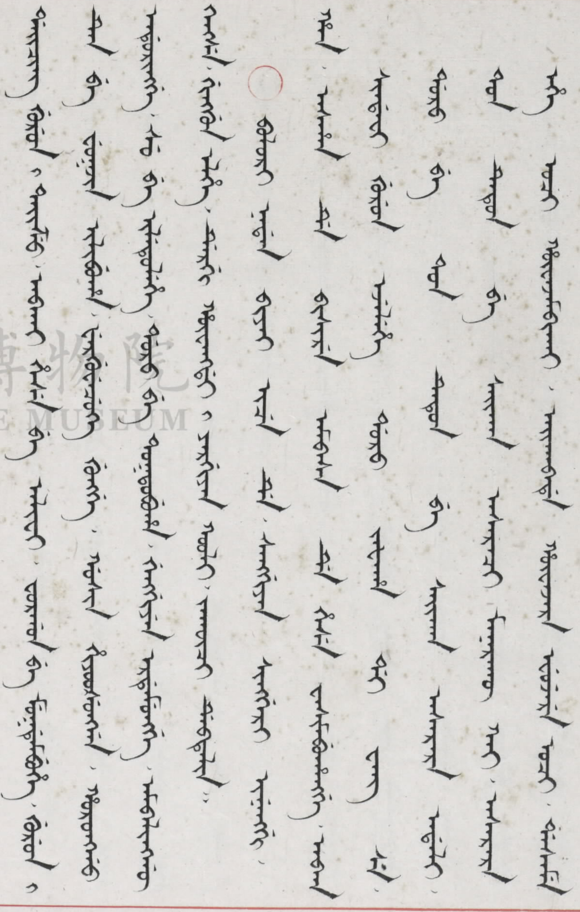

# 满文预处理程序
**该文件实现了数据清洗，图像拆分，二值化等操作**
   
>- pdf_merge.py  
我们得到的满文数据，是**pdf形式**的图像，为了对每个字进行分隔我们需要把数据变成**png形式**的。使用了pdf_merge.py把pdf文件整合到merge.pdf里，然后对这一个文件进行分割转换。  
>- **ConvertToPng.py**  
把merge.pdf按页分隔成多个png文件。  
>- **crop_page.py**  
使用该代码对png文件进行切割，使用了**OpenCV**(cv2)对图像进行读写。由于下一步需要对切割后的页面进行二次切割，因此要保证切割的完整性，以确保文字不会缺失，尤其是左右边距，要尽可能保证左右边距相同，否则会对二次切割造成负面影响。  
`cv2.imread(path)`: 读取图像。从指定的文件路径加载图像，并将其转换为一个多维 NumPy 数组（例如，一个彩色图像是 [高度, 宽度, 通道数] 的数组），这样后续的所有处理都可以通过操作这个数组来完成。  
`cv2.imwrite('./data/cropped_png/image_'+str(j)+'.png', cropped_image1)`: 保存图像。将处理后的图像数组（NumPy 数组）保存成指定格式（如 PNG, JPG）的文件。  
如下图，下载的数据集格式是统一的，因此我们只需要设置一次上下左右边界就可对所有图片进行裁剪。  
  
裁剪后的图片样式
   
 >- **crop_page.py**  
 接下来进行二次切割，观察上一步的切割结果，可以发现每一个页面最多只有十列文字，且分布均匀，因此可以将每个页面平均切割为十列，获得单列文字。  
`part_width = width // 10`   
 **这个方法似乎非常基础，他不能应变更加复杂的情况，是否有更加好的办法来精准的分隔列与列（在汉字中则是行与行）**  
>- **binarization.py**  
最后，为了减少噪声对识别的影响，对切割后的单列文字进行二值化操作
----
